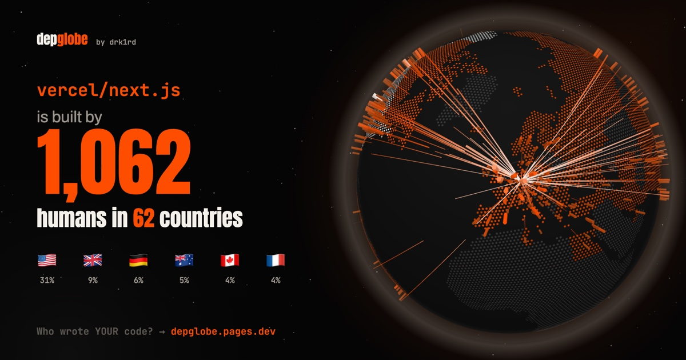

# depglobe

> Paste any GitHub repo URL and see **where in the world your code comes from.**

A spinning 3D globe of every human and org behind a repo's dependencies — any language — with a risk layer for companies and share exports built to be posted.

**Live: https://depglobe.pages.dev/** · no token needed · 360+ popular repos load instantly · built by [drk1rd](https://suryansh.one)



## How it works

```
repo URL
  → GitHub SBOM API            every dependency, every ecosystem, one call
  → dedupe + cap               direct deps first · 200 packages (no token) / 400 (token)
  → deps.dev                   package → GitHub source repo + OpenSSF Scorecard
  → ecosyste.ms   (no token)   owner + top committers + archived/pushedAt + locations, open data, 5k req/hr per visitor
    GitHub GraphQL (token)     optional "turbo": last-60-commit authors, 20 repos per query
  → offline geocoder           ~9k cities + 250 countries + aliases, flags, US states, CJK names
  → globe.gl                   dot-hex countries lit by share, pillars per place, arcs to HQ
```

Everything runs in the browser. The optional token is kept in `sessionStorage` (or `localStorage` if you tick *remember*) and is only sent to `api.github.com`. Results are cached in IndexedDB for 7 days. If GitHub's anonymous SBOM limit is hit, direct dependencies are read from ecosyste.ms manifests instead.

## Made to be shared

- **Share** → wide (X / LinkedIn), square (Instagram) and 9:16 story cards, plus an 8-second vertical **Reel** recorded straight from the live globe
- **✨ Story tab** → Wrapped-style facts: furthest maintainer from HQ, time zones spanned, the one person behind 12 of your packages
- **Fly tour** → the camera visits the top countries with big captions (great for screen recordings)
- **Poster mode** (`P`) → hides all UI for clean screenshots
- Hover a country in the panel to light it up on the globe, and vice-versa

## Develop

```bash
npm install
npm run dev
```

| Script | What it does |
|---|---|
| `npm run dev` | Vite dev server |
| `npm run build` | Typecheck + production build to `dist/` |
| `npm run build:places` | Regenerate `src/data/places.json` + `countries.json` from GeoNames / world-countries |
| `npm run build:demos` | Precompute globes into `public/demos/` (needs `GITHUB_TOKEN`) |

Regenerate or add demos:

```bash
GITHUB_TOKEN=$(gh auth token) npm run build:demos -- pallets/flask gin-gonic/gin
```

Precomputed repos load instantly and replay the scan animation. `?repo=owner/name` deep-links to any repo; add `&live=1` to force a live scan of a precomputed one. To precompute the top-starred repos:

```bash
GITHUB_TOKEN=$(gh auth token) npm run build:demos -- --file top.txt --concurrency 3
```

## Risk panel

- 🌐 **Jurisdiction concentration** — share of located dependency weight per country, and how many countries cover half of it
- 🧍 **Single maintainer** — only one person behind nearly all commits (without a token: the only committer with ≥5% of all-time commits; with a token: sole human author of the last 60 commits)
- 🪦 **Abandoned** — archived, or no push in 2+ years
- 🛡 **Low OpenSSF Scorecard** — below 4/10

Flags describe **packages, never people**. Location is self-reported free text, and where someone lives says nothing about trustworthiness — this is about concentration and sovereignty.

## Deploy

Static build, relative paths, no backend. Hosted on **Cloudflare Pages** at `depglobe.pages.dev`:

1. Cloudflare dashboard → Workers & Pages → Create → Pages → connect `drk1rd/depglobe`
2. Project name **`depglobe`** (this becomes the `depglobe.pages.dev` subdomain)
3. Framework preset: none · build command `npm run build` · output directory `dist` · env var `NODE_VERSION=22`

Every push to `main` redeploys. If you host it anywhere else, update the absolute `og:image` / `og:url` / `twitter:image` URLs in `index.html` (link previews need absolute URLs).

## Data & credits

GitHub dependency-graph SBOM + GraphQL APIs · [deps.dev](https://deps.dev) (Open Source Insights) · [OpenSSF Scorecard](https://scorecard.dev) · [GeoNames](https://www.geonames.org) via `all-the-cities` (CC BY 4.0) · `world-countries` · Natural Earth via `world-atlas` · [globe.gl](https://globe.gl)

## Roadmap

- **v2 — Metro view:** a second tab that renders the repo's *internal* architecture as a subway map (modules → stations, import chains → lines). Globe = where your code comes from; Metro = how it's wired.
- `npx depglobe <url>` CLI reusing `src/pipeline`
- Per-repo OG images via a small edge function

## License

[MIT](LICENSE) © Suryansh Prajapati ([drk1rd](https://suryansh.one))
